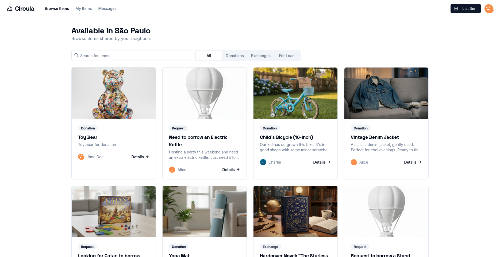

# Circula - Community Exchange Platform



This repository contains my submission for the [DEV Weekend Challenge](https://dev.to/devteam/happening-now-dev-weekend-challenge-submissions-due-march-2-at-759am-utc-5fg8). Circula is a local mini-economy platform that connects neighbors to donate, exchange, and borrow items within their community.

## Problem & Solution

In every neighborhood, people have items they no longer need but others could use. At the same time, many people need temporary access to items they don't want to buy. Circula bridges this gap by creating a trusted community marketplace where neighbors can:

- **Donate** items they no longer need
- **Exchange** items with others
- **Borrow** items temporarily

## 📌 Table of Contents

- [Features](#features)
- [Tech Stack](#tech-stack)
- [Demo](#demo)
- [Get Started](#get-started)
- [Usage](#usage)
- [Contributing](#contributing)
- [License](#license)

## 💡 Features

- 🔄 **Multiple Exchange Types**: Support for donations, exchanges, and borrow requests
- 🔍 **Smart Search & Filter**: Find items by type, category, or keywords
- 📱 **Responsive Design**: Works seamlessly on desktop and mobile
- 💬 **Built-in Messaging**: Direct communication between users
- 👤 **User Profiles**: View item history and community reputation
- 🖼️ **Image Support**: Upload photos of items to showcase them
- 📄 **Pagination**: Smooth browsing through large item collections

## 🛠 Tech Stack

- **Framework**: Next.js 16 with App Router
- **Language**: TypeScript
- **Styling**: TailwindCSS + shadcn/ui
- **State**: React hooks + LocalStorage
- **Icons**: Lucide React
- **Forms**: React Hook Form + Zod

## 🚀 Demo

Live demo available at: [circula.vercel.app](https://circula.vercel.app/)

> **Note**: This project currently uses mock data and LocalStorage as a temporary repository for testing purposes. A real backend can be integrated in the future.

## 🛠 Get Started

### Prerequisites

- Node.js (v18+)
- npm

### Installation

```bash
# Clone the repository
git clone https://github.com/wesleybertipaglia/circula.git

# Navigate into the project folder
cd circula

# Install dependencies
npm install
```

### Running the Project

```bash
# Start the development server
npm run dev

# Open your browser and navigate to
http://localhost:9002/
```

### Building for Production

```bash
# Create production build
npm run build

# Start production server
npm start
```

## 📖 Usage

1. **Browse Items**: View available items in your area with filtering options
2. **Create Account**: Sign up to start listing or requesting items
3. **List an Item**: Choose between donation, exchange, or borrow
4. **Connect**: Message other users to arrange the exchange
5. **Complete Exchange**: Coordinate with the other party to finalize

## 🤝 Contributing

Contributions are welcome! If you have any suggestions or improvements, please open an issue or a pull request.

## 📄 License

This project is licensed under the MIT License.
